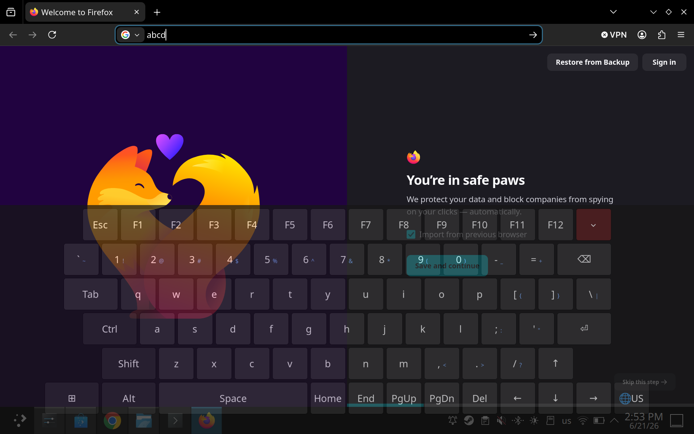

# Better Handheld Keyboard

> **Heads up:** this is for **Desktop Mode** (KDE Plasma). Game Mode works
> differently under the hood and isn't covered here.



If you've ever tried to do something *real* on a SteamOS handheld in Desktop
Mode — open a terminal, use an app with keyboard shortcuts — you've probably hit
the same wall I did.

The built-in on-screen keyboard just couldn't do it. No working `Ctrl`, so no
`Ctrl+C` in the terminal. No reliable `Tab`, `Esc`, or arrow keys. It was opaque
and covered half the screen, and it felt sluggish to bring up. Fine for typing a
Wi-Fi password; useless for actually using the machine.

So I built the keyboard I wanted instead. Here's what it does differently:

- **It types real keystrokes.** Instead of faking input, it injects keys through
  `/dev/uinput` — the same path a real USB keyboard uses. So `Ctrl`, `Alt`,
  `Shift`, `Super`, `F1`–`F12`, `Tab`, `Esc`, and arrows all genuinely work,
  everywhere. `Ctrl+C` in a terminal just works.
- **It uses the button you already press.** I remapped the hardware keyboard
  button so it summons this keyboard instead of the stock one. Press to show,
  press again to hide — no menus, no Steam Input fiddling.
- **It's see-through.** Adjustable transparency, so it's not blinding the screen
  behind it.
- **It's mine to theme, and yours too.** Layout, colours, key sizes, and opacity
  all live in a JSON file. No code to touch.
- **US / UK layouts.** A 🌐 key flips the layout so `£`, `@`, `#`, `"` land where
  they should.

## Install

Double-click **`Install Better Handheld Keyboard.desktop`**, enter your password
once (it needs `/dev/uinput` access — that's how it types real keys), then **log
out and back in**.

Prefer the terminal? `./install.sh`, then log out and back in.

## How it works

```
  keyboard button ──remap──▶ InputPlumber ──DBus event──▶ handheld-kbd
                                                    tap a key │
                                                              ▼
                              focused app ◀── real keystroke ◀── /dev/uinput
```

The button is remapped to fire a **DBus event** rather than a keystroke, so
nothing else reacts to it. Key taps go through **`/dev/uinput`** at the kernel
level — which is why they reach any app.

## Configure

Everything's in `~/.config/handheld-kbd/config.json` — `opacity`, `layout`,
`locale`, `theme`, key sizes, optional `hotkey`. Edits apply next time the
keyboard restarts. Layouts and locales sit beside it as plain JSON.

## Uninstall

`./uninstall.sh` (your config is left in place).

## Requirements

KDE Plasma 6 (Wayland) · `python3`, `python-gobject` (GTK 3), `python-evdev`.
The installer adds you to the `input` group.

## License

MIT — see [LICENSE](LICENSE). It's all local; nothing leaves your device.
