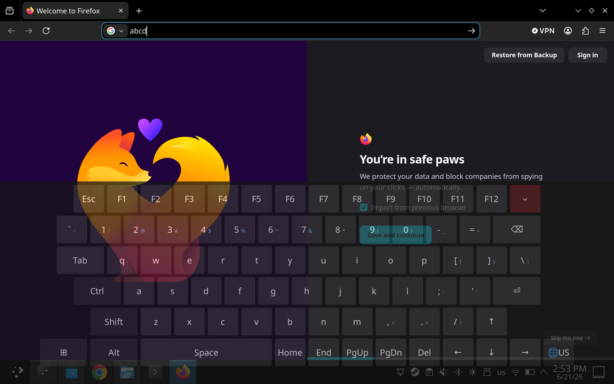

# Better Handheld Keyboard

> **Heads up:** this is for **Desktop Mode** (KDE Plasma). Game Mode works
> differently under the hood and isn't covered here.



If you've ever tried to do something *real* on a SteamOS handheld in Desktop
Mode — open a terminal, use an app with keyboard shortcuts — you've probably hit
the same wall I did.

The built-in on-screen keyboard just couldn't do it. No working `Ctrl`, so no
`Ctrl+C` in the terminal. No reliable `Tab`, `Esc`, or arrow keys. It was opaque
and covered half the screen, and it felt sluggish to bring up. Fine for typing a
Wi-Fi password; useless for actually using the machine.

So I built the keyboard I wanted instead. Here's what it does differently:

- **It types real keystrokes.** Instead of faking input, it injects keys through
  `/dev/uinput` — the same path a real USB keyboard uses. So `Ctrl`, `Alt`,
  `Shift`, `Super`, `F1`–`F12`, `Tab`, `Esc`, and arrows all genuinely work,
  everywhere. `Ctrl+C` in a terminal just works.
- **It uses the button you already press.** I remapped the hardware keyboard
  button so it summons this keyboard instead of the stock one. Press to show,
  press again to hide — no menus, no Steam Input fiddling.
- **It's see-through.** Adjustable transparency, so it's not blinding the screen
  behind it.
- **It's mine to theme, and yours too.** Layout, colours, key sizes, and opacity
  all live in a JSON file. No code to touch.
- **US / UK layouts.** A 🌐 key flips the layout so `£`, `@`, `#`, `"` land where
  they should.
- **Predictive text.** A row of tappable suggestions above the keys. It learns
  what *you* type, and `handheld-kbd-build-dict` adds corpus frequencies so it's
  useful from the first keypress. Tapping a suggestion types it as real keys, so
  it works in any app. Off with `"prediction": false`.
- **Two sizes.** The ⤢ key toggles between the normal keyboard and a taller one
  with bigger keys — thumbs on a 7-inch panel, or precision when you're docked.
  Toggles live, no relogin.
- **Cycle transparency from the keyboard.** The ◐ key steps through
  `opacity_steps` instead of making you edit JSON to see what's underneath.
- **Put it where you want it.** The ✥ key unlocks the keyboard: a bar appears
  along the top, drag it anywhere, grab either end to resize, then press ✥ again
  to lock it there. It remembers the spot. Useful when the bottom edge is where
  the thing you're typing into lives, or when an external monitor has left the
  keyboard on the wrong screen.
- **Swipe typing.** Drag across the letters instead of tapping them. Taps are
  unaffected — a drag only counts once it's unmistakably not one.
- **Optional summon gestures.** Two-finger swipe up from the bottom edge
  (`gesture_summon`), or auto-show whenever a text field takes focus
  (`show_on_focus`, via AT-SPI). Both off by default.
- **Survives sleep and fullscreen.** It re-initialises after resume, and stays
  visible above fullscreen windows instead of disappearing behind them.

## Install

Double-click **`Install Better Handheld Keyboard.desktop`**, enter your password
once (it needs `/dev/uinput` access — that's how it types real keys), then **log
out and back in**.

Prefer the terminal? `./install.sh`, then log out and back in.

## How it works

```
  keyboard button ──remap──▶ InputPlumber ──DBus event──▶ handheld-kbd
                                                    tap a key │
                                                              ▼
                              focused app ◀── real keystroke ◀── /dev/uinput
```

The button is remapped to fire a **DBus event** rather than a keystroke, so
nothing else reacts to it. Key taps go through **`/dev/uinput`** at the kernel
level — which is why they reach any app.

## No keyboard at all? Read this

If you installed an earlier version on a **Legion Go 1** — or on a Steam Deck / ROG Ally
running Bazzite or ChimeraOS — you may have ended up with *no* on-screen keyboard. Sorry.
The installer picked its "seamless" trigger by looking at InputPlumber's default profile,
which advertises a keyboard button on every device, and remapped a button your hardware
never actually sends. Meanwhile it kept Steam's own keyboard transparent. Both keyboards
gone.

Fix it either way:

```bash
handheld-kbd-recover          # puts Steam's keyboard back, switches this one to mirror mode
./install.sh                  # re-running the installer now repairs the same thing
```

Or double-click **`Recover My Keyboard.desktop`** in this folder — no typing required, which
rather matters when you have no keyboard.

Want out entirely? `handheld-kbd-recover --stock-only` stands everything down and hands the
desktop back to Steam's keyboard.

## Predictive text

Prediction works out of the box from what you type. For suggestions that are useful
before it has learned anything, build the corpus data once:

```bash
handheld-kbd-build-dict
```

That writes `unigrams.txt` and `bigrams.txt` into `~/.local/share/handheld-kbd/`. It
prefers Peter Norvig's `count_1w.txt` / `count_2w.txt` if you drop them in
`~/.local/share/handheld-kbd/raw/`, and falls back to the system aspell dictionary
when offline. Re-runnable, and it never touches `learned.json` — that's your personal
vocabulary, stays on the device, and is in `.gitignore` for a reason.

Turn learning off with `"predict_learn": false` (corpus only), or prediction entirely
with `"prediction": false`.

## Configure

Everything's in `~/.config/handheld-kbd/config.json` — `opacity`, `layout`,
`locale`, `theme`, key sizes, optional `hotkey`. Edits apply next time the
keyboard restarts. Layouts and locales sit beside it as plain JSON.

## Uninstall

`./uninstall.sh` (your config is left in place).

## Requirements

KDE Plasma 6 (Wayland) · `python3`, `python-gobject` (GTK 3), `python-evdev`.
The installer adds you to the `input` group.

## License

MIT — see [LICENSE](LICENSE). It's all local; nothing leaves your device.
